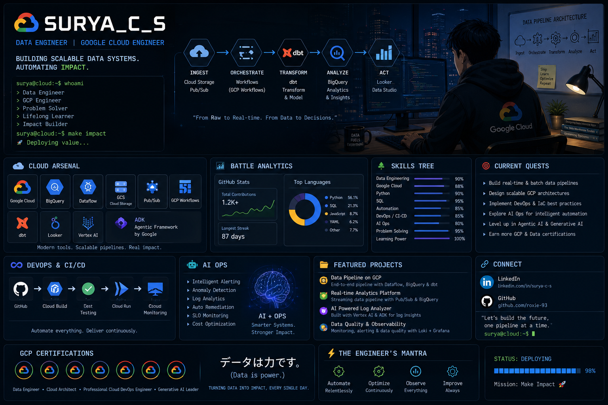

<div align="center">



# ☁️ SURYA.EXE

### Senior GCP Data Platform Engineer

Building scalable data platforms • DevOps • AI Engineering • Intelligent Automation


<br>


</div>

---

# ⚔️ Platform Profile

```yaml
Name:
  Surya

Role:
  Senior GCP Data Platform Engineer

Focus:
  Data Engineering
  Cloud Engineering
  DevOps
  AI Engineering

Current Mission:
  Build → Automate → Scale

Core Stack:
  BigQuery
  Dataflow
  Workflows
  dbt
  Vertex AI
  Google ADK
```

---

# ☁️ Platform Arsenal

<div align="center">

### Data Platform


---

### AI Engineering


---

### DevOps & Delivery


---

### Engineering


</div>

---

# 📈 Engineering Analytics

<div align="center">


</div>

---

# 📜 Capability Matrix

```text
☁️ GCP Architecture         ███████████████░ 95%
📊 Data Engineering         █████████████░░░ 90%
🔄 Data Transformation      █████████████░░░ 90%
⚙️ DevOps / CI-CD          ████████████░░░░ 85%
🤖 AI Engineering          ███████████░░░░░ 82%
🧠 Agentic Systems         ██████████░░░░░░ 80%
📈 AIOps                   ██████████░░░░░░ 78%
🚀 Platform Reliability    █████████████░░░ 90%
```

---

# 🎯 Current Missions

⚡ Build scalable GCP Data Platforms

⚡ Design event-driven cloud architecture

⚡ Transform analytics using dbt

⚡ Build intelligent agents with Google ADK

⚡ Deploy ML using Vertex AI

⚡ Enable DevOps & CI/CD

⚡ Improve observability with AIOps

---

# 🏯 Featured Domains

### 📊 Data Engineering
ETL • ELT • Streaming • Analytics

### ☁️ Cloud Platform
BigQuery • Dataflow • Workflows • IaC

### 🤖 AI Engineering
Vertex AI • ADK • Agentic Systems

### ⚙️ Platform Engineering
DevOps • CI/CD • Reliability

---

# 🏆 Achievement Board

<div align="center">


</div>

---

# 🔥 Contribution Analytics

<div align="center">


</div>

---

# 🗡️ Engineering Philosophy

> Build Platforms → Enable Teams → Scale Impact

> Reliability • Automation • Intelligence

---

# ⚡ Current Architecture

```text
INGEST
 ↓
TRANSFORM (dbt)
 ↓
ORCHESTRATE (Workflows)
 ↓
MODEL (Vertex AI)
 ↓
AGENTS (Google ADK)
 ↓
DEPLOY (CI/CD)
 ↓
OBSERVE (AIOps)
 ↓
SCALE
```

---

# 🌐 Connect

<div align="center">

<a href="https://www.linkedin.com/in/surya-c-s/">


</a>

<a href="https://github.com/roxie-93">


</a>

</div>

---

<div align="center">

### ☁️ Building the next platform.

</div>

