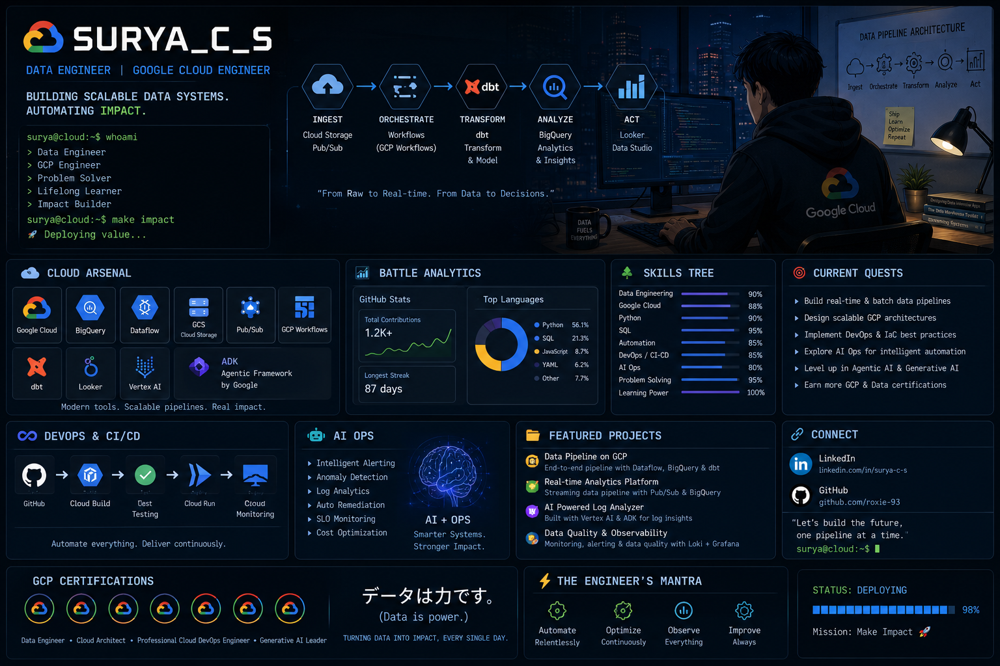

# Hi there, I'm Surya 👋
### Senior GCP Data Platform Engineer & AI Systems Builder

  
  
  

---

### 🚀 About Me

- ☁️ **Cloud & Data Platform**: Architecting high-throughput, resilient data platforms on **Google Cloud Platform** (*BigQuery, Dataflow, Cloud Workflows*).
- 🔄 **Analytics Engineering**: Modern data transformation, modeling, and automated testing with **dbt** & SQL.
- 🤖 **AI & Agentic Systems**: Building intelligent agents and enterprise GenAI solutions using **Vertex AI** and **Google ADK**.
- ⚙️ **Platform & DevOps**: Infrastructure as Code with **Terraform**, automated CI/CD pipelines, and observability with **AIOps**.

---

### 🛠️ Tech Arsenal

| Domain | Technologies |
| :--- | :--- |
| **GCP & Data** |      |
| **AI & Automation** |    |
| **DevOps & Core** |      |

---

### 📊 GitHub Analytics & Activity

  <table>
    <tr>
      <td>
        
      </td>
      <td>
        
      </td>
    </tr>
  </table>

   

  

---

  ⚡ <b>Build → Automate → Scale</b> • Crafting reliable, intelligent cloud platforms.

